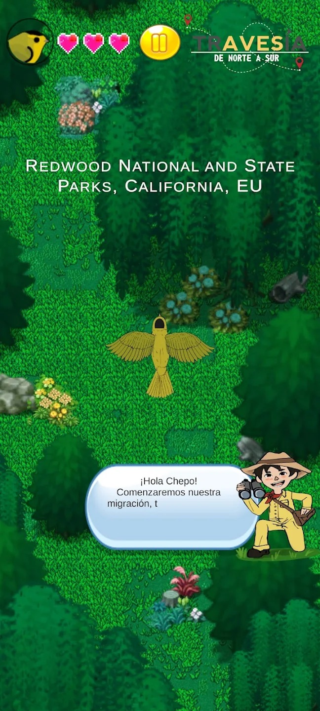
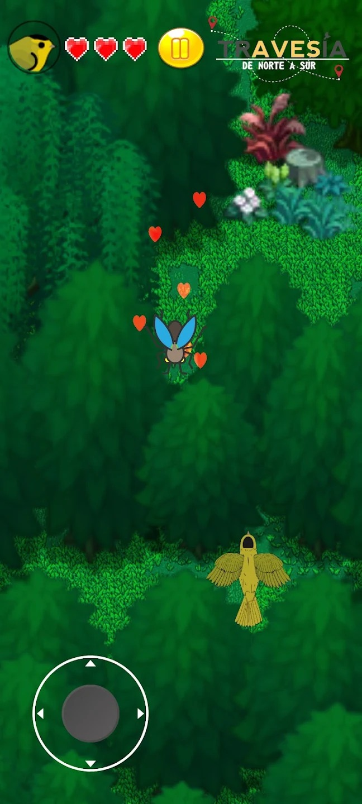

# Hello Everyone!👋 I am Mario Alberto, Welcome to my repository.
### Computer System engineer
> Unity developer, Specility studys in Programming moviles

## Tecnologies
 

 

 

 

 

 

 

# My Projetcs
## Travesía de Norte a Sur

    

<!--
**Dobugix/Dobugix** is a ✨ _special_ ✨ repository because its `README.md` (this file) appears on your GitHub profile.

Here are some ideas to get you started:

- 🔭 I’m currently working on ...
- 🌱 I’m currently learning ...
- 👯 I’m looking to collaborate on ...
- 🤔 I’m looking for help with ...
- 💬 Ask me about ...
- 📫 How to reach me: ...
- 😄 Pronouns: ...
- ⚡ Fun fact: ...
-->
